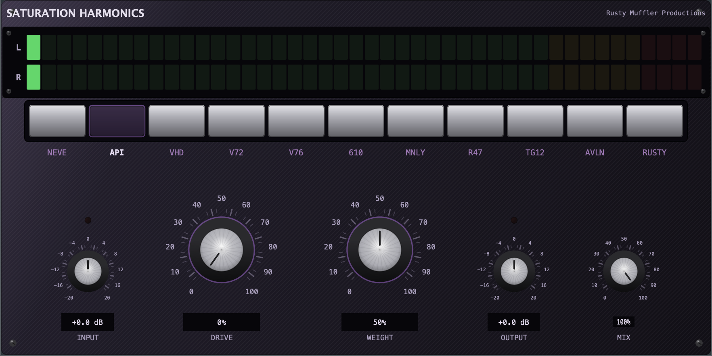
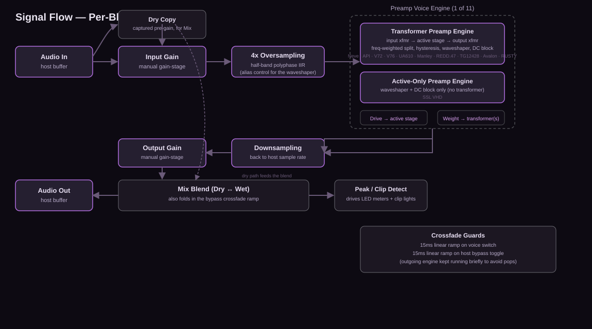

# Saturation Harmonics Plugin

**A multi-voice analog-saturation plugin for macOS, built with AI-assisted development — the harmonic character of classic preamps, without emulating the hardware itself.**

## Overview

Saturation Harmonics Plugin is a macOS audio plugin (AU / VST3 / Standalone) for Logic Pro and other DAWs that adds analog-style harmonic saturation to a track or bus. Rather than modeling any single piece of hardware end-to-end, it borrows the *harmonic and saturation behavior* of eleven classic preamps — how each one generates even/odd harmonics, how its transformer stage colors low end, how it responds as you drive it harder — and makes that behavior selectable and controllable in one plugin.

It's built for musicians, mix engineers, and producers who want the character of vintage preamp coloration as a fast, switchable tool inside a modern DAW session, without patching in outboard gear or committing to one "flavor" per channel strip.

## The problem it solves

Classic preamp coloration is one of the most-reached-for tools in analog-style mixing, but getting it in the box usually means either:

- a single-hardware plugin emulation per preamp (buy/license several to get a few different flavors), or
- a generic saturation plugin with one "curve" and no distinct hardware character at all.

This plugin sits between those two: **one plugin, eleven distinct harmonic voices**, each modeling what actually matters for saturation character — active-stage clipping behavior and transformer-stage low-frequency coloration — rather than reproducing an entire circuit.

## Key features

- **11 selectable preamp voices**, each with its own harmonic signature: Neve 1073, API 512c, Telefunken V72, Telefunken V76, UA 610, Manley, EMI REDD.47, EMI TG12428, Avalon VT-737, SSL VHD, and RUSTY — an original, more aggressive hybrid voice not modeled on any single unit.
- **Two-stage control model** — independent **Drive** (the active tube/op-amp/FET stage) and **Weight** (that voice's own transformer stage), rather than one generic "amount" knob. Weight defaults to each voice's authentic baked-in transformer drive, and can be dialed back toward a cleaner, more transparent sound.
- **Per-voice discrete character switches** where the real hardware has one — e.g. UA 610's input impedance switch, EMI REDD.47's Rumble Filter — modeled as tonal/harmonic consequences, not literal circuit switches.
- **Manual gain-staging** (Input / Output) plus a global **Mix** knob for parallel (New York–style) saturation blending.
- **Metering**: segmented LED-style level meters and dedicated clip indicators on the Input and Output stages.
- **Pop-free voice switching and host bypass** — short internal crossfades prevent the audible click that a naive instant engine swap or bypass toggle would otherwise produce.
- **4x oversampled processing** to keep the nonlinear saturation stage alias-free.

## Screenshots

A real screenshot of the running plugin, default state, no audio loaded (all values shown are the plugin's defaults, not real session data):

*More screenshots — different voices selected, meters active, the per-voice aux switch — coming as the UI settles further.*

## Tech stack

- **C++17**, built on the **JUCE** framework (audio plugin framework used across AU/VST3/Standalone targets)
- **CMake** build system
- Formats: **Audio Unit (AU)** and **VST3** plugin, plus a **Standalone** app — all targeting **macOS** (developed and validated against Logic Pro)
- Hand-rolled headless test executables (no external test framework) that exercise the DSP engines directly — bypass exactness, boundedness, harmonic-growth behavior, and per-voice comparative checks — run independently of the plugin UI

## Architecture / approach

The plugin separates **DSP engines** from the **UI** cleanly, and separates each preamp voice's *transformer* character from its *active-stage* character so the two can be tuned independently per voice.

At a high level, each audio block runs: **Input gain → 4x oversampling → the selected voice's engine → downsampling → Output gain → dry/wet Mix blend**, with a dry copy of the signal captured before any processing for the Mix knob. Short internal crossfades protect against clicks when switching voices or toggling the host's bypass mid-stream.

There are two engine families, and every voice reuses one of them rather than getting bespoke DSP code:

- **Transformer-family engine** — for voices with a real transformer stage (most of them): input transformer → active stage (the tanh-based waveshaper) → output transformer, each transformer stage modeled as a frequency-weighted low-end-first nonlinearity with light hysteresis.
- **Active-only engine** — for transformerless, solid-state designs (currently SSL VHD): just the active-stage waveshaper, no transformer coloration.

## My role and how I used AI to build it

I'm a technology leader focused on **AI enablement** — helping teams adopt AI-assisted workflows effectively. This plugin is a personal project I use to stay hands-on with what AI-assisted development can actually do end-to-end: I directed the design (preamp selection, control philosophy, UI/UX decisions, what to build next) and did the research behind the DSP reference material, while Claude Code did the C++/JUCE implementation, wrote and ran the DSP test suite, and iterated on the UI under my review at each step. I'm not presenting this as deep solo low-level DSP engineering — the value I bring is direction, product judgment, and evaluating the AI's output, which is exactly the AI-enablement skill set I focus on professionally.

## Current status

**In development, not yet released.** All 11 preamp voices have working DSP engines with passing automated tests (100+ headless checks across both engine families) and a functioning UI, but the plugin has not yet gone through a dedicated by-ear tuning/listening pass against real material, and hasn't shipped a version 1.0. Versioning is intentionally kept at 0.x until that's done.

## Source available on request

This repository contains documentation and visuals only — the implementation lives in a private repository. Happy to walk through the code, architecture decisions, or test suite directly; reach out if you'd like access.
